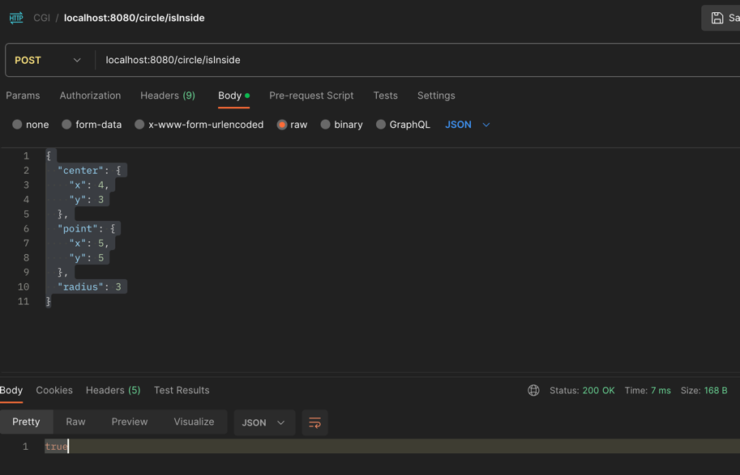

Swagger-UI: http://localhost:8080/swagger-ui/index.html

You can run this app in terminal.
`cd` to directory where .jar file is located and run
`java -jar CgiDemo-0.0.1-SNAPSHOT.jar`

example of API-CALL:
